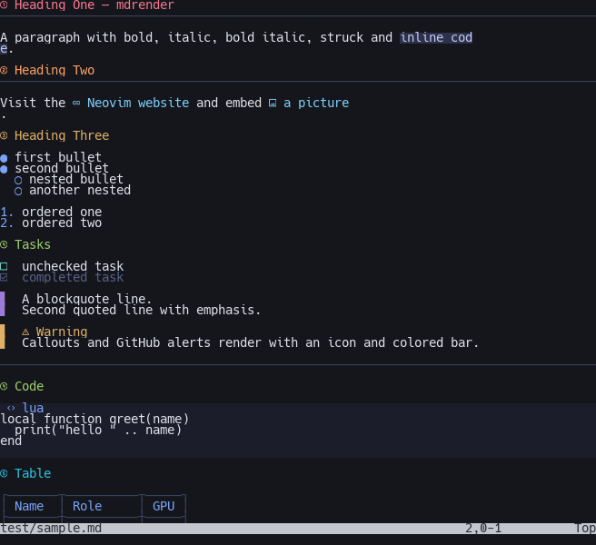
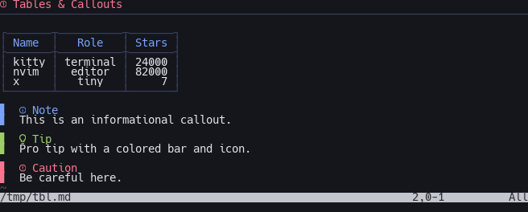

# mdrender.nvim

In-buffer Markdown rendering for Neovim, tuned for **GPU-accelerated terminals**
(kitty, Ghostty, WezTerm, iTerm2). It decorates Markdown live as you read —
conceals the raw syntax, overlays Nerd-Font glyphs, and paints true-color
highlights — and on terminals that speak the kitty graphics protocol it can draw
real images inline.

No treesitter dependency: the decorator is a self-contained, line-oriented
extmark engine.



*`test/sample.md` rendered live (Nerd Font, true color).*

## Features

- **Headings** — `#`…`######` concealed, per-level glyph + colored line, with a
  a full-width underline rule below H1/H2.
- **Emphasis** — `**bold**`, `*italic*`, `***bold italic***`, `~~strikethrough~~`.
- **Inline code** & **fenced code blocks** — backgrounded, with a language label.
- **Lists** — bullets become `● ○ ◆ ◇` by depth; ordered numbers colored.
- **Task lists** — `- [ ]` / `- [x]` become checkbox glyphs; done items dimmed.
- **Tables** — redrawn as proper box-drawn, column-aligned tables
  (`┌─┬─┐ │ ├─┼─┤ └─┴─┘`) honoring `:--`/`--:`/`:-:` alignment.
- **Callouts / alerts** — `> [!NOTE]`, `[!TIP]`, `[!IMPORTANT]`,
  `[!WARNING]`, `[!CAUTION]` (and aliases) get an icon, colored title and bar.
- **Blockquotes** — a colored bar replaces `>`.
- **Horizontal rules** — drawn as a full-width line.
- **Links & images** — URL hidden, text styled, with a leading icon.
- **Anti-conceal** — the line under the cursor shows raw Markdown for editing.
- **Graphical preview** — an optional browser-quality rendered page
  (real fonts, syntax highlighting, bordered tables) shown as an image in a
  split via headless Chrome + the kitty graphics protocol. See below.
- **Inline images** (experimental) — local images rendered via the kitty
  graphics protocol on supported terminals.



*Box-drawn tables with column alignment, plus callouts / alerts.*

## Requirements

- Neovim **0.10+**
- A GPU-accelerated terminal is recommended (kitty / Ghostty / WezTerm / iTerm2).
  On other terminals it still works but falls back to ASCII markers and disables
  images. Set `require_gpu = true` to restrict the plugin to GPU terminals only.
- A **Nerd Font** for the glyphs (otherwise icons show as missing boxes).
- For inline images: ImageMagick (`magick`/`convert`) is only needed for
  non-PNG formats; PNGs work natively.

## Install

With [lazy.nvim](https://github.com/folke/lazy.nvim):

```lua
{
  "InfJoker/mdrender.nvim",
  ft = "markdown",
  opts = {}, -- lazy calls require("mdrender").setup(opts) for you
}
```

With [packer](https://github.com/wbthomason/packer.nvim):

```lua
use({ "InfJoker/mdrender.nvim" })
```

With [vim-plug](https://github.com/junegunn/vim-plug):

```vim
Plug 'InfJoker/mdrender.nvim'
```

Calling `setup()` is **optional** — the plugin auto-activates on Markdown
buffers with sensible defaults. Pass `opts`/`setup({...})` only to override
them.

## Configuration

Defaults (override any subset):

```lua
require("mdrender").setup({
  enabled = true,
  filetypes = { "markdown", "markdown.mdx" },
  require_gpu = false,   -- true => only decorate on GPU terminals
  anti_conceal = true,   -- reveal raw markdown on the cursor line
  conceal_level = 2,
  render_modes = { "n", "v", "V", "\22", "c", "t" }, -- not insert

  heading  = { enabled = true, icons = { "󰲡 ", "󰲣 ", "󰲥 ", "󰲧 ", "󰲩 ", "󰲫 " }, underline = 2 },
  bullet   = { enabled = true, icons = { "●", "○", "◆", "◇" } },
  checkbox = { enabled = true, unchecked = { icon = "󰄱 " }, checked = { icon = "󰱒 " } },
  quote    = { enabled = true, icon = "▋ " },
  code     = { enabled = true, style = "full", language = true, lang_icon = "󰅴 " },
  dash     = { enabled = true, icon = "─" },
  link     = { enabled = true, icon = "󰌷 ", image_icon = "󰥶 " },
  table    = { enabled = true },     -- box-drawn, column-aligned
  callout  = { enabled = true },     -- > [!NOTE] / [!TIP] / [!WARNING] / …

  images = {            -- experimental, off by default
    enabled = false,
    max_width = 80,
    cell_pixels = { 8, 17 },
  },
})
```

Every highlight group is defined with `default = true`, so your colorscheme wins.
Override e.g. `MdRenderH1`, `MdRenderCode`, `MdRenderLink`, … to taste.

## Commands

```
:MdRender toggle    " toggle decorations in the current buffer
:MdRender enable
:MdRender disable
:MdRender status    " show attach / gpu / terminal / image state
:MdRender image     " render the image under the cursor (kitty protocol)
```

## Graphical preview

Two ways to view Markdown:

1. **In-buffer decorations** (default) — the terminal-native styled view shown
   above, where you edit and read in the same buffer.
2. **Graphical preview** — a true browser-quality rendered page (real fonts,
   heading sizes, syntax-highlighted code, bordered tables, styled callouts)
   shown as an *image* in a split, refreshing as you edit.

```vim
:MdRender preview     " toggle the graphical preview split
```

How it works: the buffer is rendered to HTML with a styled CSS theme
(`marked` + `highlight.js` run client-side), captured with **headless Chrome**,
and displayed in a split via the **kitty graphics protocol** (Unicode-placeholder
placements, so the image is anchored to buffer cells and survives redraws / works
under tmux passthrough). The preview **scrolls to mirror your cursor position**
in the source window, and refreshes on save (or on every edit with
`preview.refresh = "edit"`).

For speed it keeps a **persistent renderer warm** (a `chrome-headless-shell`
driven over the DevTools protocol by a tiny Node sidecar — no npm dependencies,
uses Node's built-in WebSocket). Each refresh captures just the **visible slice**,
so renders are ~0.1–0.3s, scrolling is smooth, and **documents of any length**
render at full quality (no row cap). If Node isn't available it falls back to a
slower per-refresh `chrome-headless-shell`/Chrome invocation (which caps very
long docs).

Requirements:

- A **kitty-graphics terminal** (kitty / Ghostty / WezTerm).
- A headless Chrome to render the page. For the **fastest refresh (~0.5s vs
  ~4s)**, install the lightweight `chrome-headless-shell` — it's auto-detected
  and preferred:

  ```bash
  npx @puppeteer/browsers install chrome-headless-shell@stable
  ```

  Otherwise the plugin falls back to full **Google Chrome / Chromium** on
  `PATH` (slower cold start). Override with `preview.chrome`.
- **Node.js** (optional but recommended): enables the persistent warm renderer
  (~0.1–0.3s refresh, smooth scroll, any document length). Without it, rendering
  still works but is slower per refresh and caps very long docs.
- **Inside tmux:** add `set -g allow-passthrough all` to your tmux config (must
  be `all`, not `on` — Neovim runs in the alternate screen). With that, the
  preview works inside tmux too.

Config (defaults):

```lua
preview = {
  chrome = nil,             -- path to Chrome/Chromium; nil => autodetect
  cell_pixels = { 8, 17 },  -- terminal cell { width, height } px (geometry/aspect)
  scale = 2,                -- device scale factor (crisper text)
  refresh = "save",         -- "save" (BufWritePost) | "edit" (debounced)
  follow = true,            -- scroll preview to follow the source window
  split = "vertical",       -- "vertical" | "horizontal"
}
```

## Inline images (experimental)

Set `images.enabled = true`. On a kitty-protocol terminal each
`` is drawn below its line using Unicode-placeholder
placements that scroll with the buffer. Notes:

- Requires kitty / Ghostty / WezTerm. **Disabled inside tmux/screen** unless you
  have graphics passthrough configured (multiplexers swallow the escape codes).
- Remote `http(s)://` images are skipped.
- Non-PNG formats need ImageMagick on `PATH`.

## Development & testing

### Headless logic checks (no terminal needed)

```bash
nvim --clean --headless --cmd "set rtp+=$PWD" -l test/headless_check.lua
```

### Visual screenshots via [`nvim-mcp`](https://github.com/InfJoker/nvim-mcp)

`nvim-mcp` drives a real Neovim instance and screenshots it. Clone it and sync
its deps with [`uv`](https://github.com/astral-sh/uv), then point the test
scripts at it (they default to `~/.local/share/nvim-mcp`):

```bash
git clone https://github.com/InfJoker/nvim-mcp ~/.local/share/nvim-mcp
uv sync --project ~/.local/share/nvim-mcp

# PTY mode -> test/render.png
uv run --project ~/.local/share/nvim-mcp python test/drive.py
# Real kitty window -> test/render_kitty.png  (macOS, GPU glyphs + images)
uv run --project ~/.local/share/nvim-mcp python test/drive_kitty.py
```

## How it works

`plugin/mdrender.lua` registers `:MdRender` and a `FileType` autocommand. On a
Markdown buffer, `render.lua` attaches autocommands (text/cursor/scroll/mode
changes) and, on each tick, scans the buffer for fenced-code regions, then
decorates the visible range with extmarks. `gpu.lua` detects the terminal to
choose Nerd-Font vs. ASCII glyphs and whether the kitty graphics protocol is
available; `image.lua` implements that protocol for inline images.
